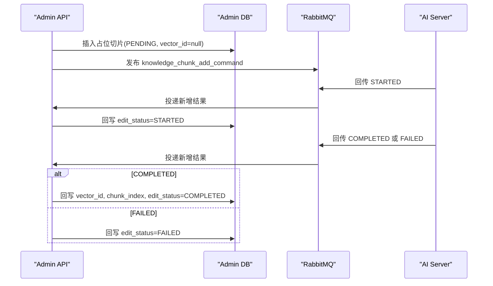

# 手工新增文档切片 MQ 对接协议

## 1. 目标

本文档用于对接 Admin 服务与 AI 服务器之间的“手工新增文档切片”异步处理链路。

适用场景：

- 运营或管理员发现现有文档知识不足，需要手工补充一条新切片。
- Admin 服务先保存本地占位切片，再通过 MQ 通知 AI 服务执行向量化与入库。
- AI 服务处理完成后，通过 MQ 回传结果，Admin 服务据此回写本地 `vector_id`、`chunk_index` 和 `edit_status`。

## 2. 入口调用时机

Admin 后台调用新增接口：

- `POST /knowledge_base/document/chunk`

请求体：

```json
{
  "documentId": 1001,
  "content": "这是手工补充的一条知识切片内容"
}
```

Admin 服务收到请求后会先在本地表 `kb_document_chunk` 插入一条占位记录：

- `document_id`：业务文档 ID
- `content`：手工补充内容
- `char_count`：内容长度
- `status`：`0`
- `edit_status`：`PENDING`
- `vector_id`：`null`
- `chunk_index`：当前文档 `max(chunk_index) + 1`，仅作临时排序值

插入成功后，Admin 服务发布 MQ command 给 AI 服务。

## 3. 时序说明



## 4. MQ 拓扑

| 类型 | 名称 | 说明 |
| --- | --- | --- |
| Exchange | `knowledge.chunk_add` | 手工新增切片交换机 |
| Queue | `knowledge.chunk_add.command.q` | Admin -> AI command 队列 |
| Queue | `knowledge.chunk_add.result.q` | AI -> Admin result 队列 |
| Routing Key | `knowledge.chunk_add.command` | command 路由键 |
| Routing Key | `knowledge.chunk_add.result` | result 路由键 |

## 5. Command 消息

### 5.1 `message_type`

- 固定值：`knowledge_chunk_add_command`

### 5.2 字段表

| 字段 | 类型 | 必填 | 来源 | 说明 |
| --- | --- | --- | --- | --- |
| `message_type` | string | 是 | Admin | 固定为 `knowledge_chunk_add_command` |
| `task_uuid` | string | 是 | Admin | 单次新增任务唯一标识 |
| `chunk_id` | long | 是 | Admin | 本地占位切片 ID，AI 必须原样回传 |
| `knowledge_name` | string | 是 | Admin | 知识库业务名称 |
| `document_id` | long | 是 | Admin | 文档主键 ID |
| `content` | string | 是 | Admin | 需要新增的切片内容 |
| `embedding_model` | string | 是 | Admin | 向量模型名称 |
| `created_at` | string | 是 | Admin | UTC ISO-8601 时间 |

### 5.3 Command 示例

```json
{
  "message_type": "knowledge_chunk_add_command",
  "task_uuid": "5f7c0e0d-4c56-4cd4-981d-d3fbd97f47a1",
  "chunk_id": 3001,
  "knowledge_name": "drug_faq",
  "document_id": 1001,
  "content": "这是手工补充的一条知识切片内容",
  "embedding_model": "text-embedding-v4",
  "created_at": "2026-03-06T17:23:41Z"
}
```

## 6. Result 消息

### 6.1 `message_type`

- 固定值：`knowledge_chunk_add_result`

### 6.2 字段表

| 字段 | 类型 | 必填 | 来源 | 说明 |
| --- | --- | --- | --- | --- |
| `message_type` | string | 是 | AI | 固定为 `knowledge_chunk_add_result` |
| `task_uuid` | string | 是 | AI | 对应 command 的任务 ID |
| `chunk_id` | long | 是 | AI | 必须原样回传 Admin 下发的 `chunk_id` |
| `stage` | string | 是 | AI | `STARTED` / `COMPLETED` / `FAILED` |
| `message` | string | 否 | AI | 当前阶段说明或失败原因 |
| `knowledge_name` | string | 是 | AI | 知识库业务名称 |
| `document_id` | long | 是 | AI | 文档主键 ID，用于与本地切片做一致性校验 |
| `vector_id` | long | 条件必填 | AI | `COMPLETED` 时必须为正整数 |
| `chunk_index` | int | 条件必填 | AI | `COMPLETED` 时必须为正整数，且为最终权威值 |
| `embedding_model` | string | 否 | AI | 实际执行的向量模型名称 |
| `embedding_dim` | int | 否 | AI | 实际向量维度 |
| `occurred_at` | string | 否 | AI | 结果事件发生时间，推荐 UTC ISO-8601 |
| `duration_ms` | long | 否 | AI | 本次处理耗时，单位毫秒 |

## 7. `stage` 状态机

AI 服务只允许发送以下阶段值：

- `STARTED`
- `COMPLETED`
- `FAILED`

Admin 服务回写规则：

| `stage` | Admin 行为 |
| --- | --- |
| `STARTED` | 回写 `edit_status=STARTED` |
| `COMPLETED` | 校验 `vector_id > 0` 且 `chunk_index > 0`，然后回写 `vector_id`、`chunk_index`、`edit_status=COMPLETED` |
| `FAILED` | 回写 `edit_status=FAILED` |

额外约束：

- `COMPLETED` 但缺少 `vector_id` 或 `chunk_index` 时，Admin 直接将本地记录回写为 `FAILED`。
- `chunk_index` 以 AI 回传值为准，本地占位时的 `max(chunk_index) + 1` 只是临时排序值。

## 8. 幂等与异常处理

Admin 服务处理 result 时遵循以下规则：

### 8.1 匹配键

- 唯一匹配键为 `chunk_id`
- `document_id` 只用于一致性校验

### 8.2 忽略条件

以下情况会直接记录日志并忽略消息：

- `chunk_id` 缺失或不是正整数
- `document_id` 缺失或不是正整数
- `stage` 非 `STARTED` / `COMPLETED` / `FAILED`
- 本地查不到对应 `chunk_id`
- 本地 `document_id` 与消息 `document_id` 不一致

### 8.3 终态幂等

本地切片一旦进入终态：

- 当前已是 `COMPLETED`，再次收到相同 `vector_id + chunk_index` 的 `COMPLETED`，按重复消息忽略
- 当前已是 `COMPLETED`，但重复 `COMPLETED` 的 `vector_id` 或 `chunk_index` 不一致，按异常消息忽略
- 当前已是 `FAILED`，后续任意结果消息都忽略

### 8.4 MQ 投递失败

若 Admin 本地占位切片已经插入成功，但 MQ command 投递失败：

- Admin 会保留该条切片记录
- 并将该条记录的 `edit_status` 回写为 `FAILED`

## 9. AI 服务必须遵守的约束

- 必须原样回传 `chunk_id`
- 必须原样回传 `document_id`
- `COMPLETED` 时必须返回正整数 `vector_id`
- `COMPLETED` 时必须返回正整数 `chunk_index`
- `chunk_index` 必须是 AI 最终确认的切片序号
- `message_type` 必须与本文档定义完全一致
- JSON 字段必须使用 snake_case

## 10. Result 示例

### 10.1 STARTED 示例

```json
{
  "message_type": "knowledge_chunk_add_result",
  "task_uuid": "5f7c0e0d-4c56-4cd4-981d-d3fbd97f47a1",
  "chunk_id": 3001,
  "stage": "STARTED",
  "message": "task accepted",
  "knowledge_name": "drug_faq",
  "document_id": 1001,
  "embedding_model": "text-embedding-v4",
  "occurred_at": "2026-03-06T17:23:42Z",
  "duration_ms": 12
}
```

### 10.2 COMPLETED 示例

```json
{
  "message_type": "knowledge_chunk_add_result",
  "task_uuid": "5f7c0e0d-4c56-4cd4-981d-d3fbd97f47a1",
  "chunk_id": 3001,
  "stage": "COMPLETED",
  "message": "vectorized successfully",
  "knowledge_name": "drug_faq",
  "document_id": 1001,
  "vector_id": 900010,
  "chunk_index": 11,
  "embedding_model": "text-embedding-v4",
  "embedding_dim": 1024,
  "occurred_at": "2026-03-06T17:23:43Z",
  "duration_ms": 245
}
```

### 10.3 FAILED 示例

```json
{
  "message_type": "knowledge_chunk_add_result",
  "task_uuid": "5f7c0e0d-4c56-4cd4-981d-d3fbd97f47a1",
  "chunk_id": 3001,
  "stage": "FAILED",
  "message": "embedding service timeout",
  "knowledge_name": "drug_faq",
  "document_id": 1001,
  "embedding_model": "text-embedding-v4",
  "occurred_at": "2026-03-06T17:23:44Z",
  "duration_ms": 3000
}
```

## 11. 对接联调清单

联调前请确认以下内容：

- AI 服务已声明并订阅 `knowledge.chunk_add` 交换机下的 `knowledge.chunk_add.command` 路由
- AI 服务已向 `knowledge.chunk_add.result` 路由回发 result 消息
- AI 服务 result JSON 字段名与本文档完全一致
- `COMPLETED` 场景已返回 `chunk_id`、`document_id`、`vector_id`、`chunk_index`
- `FAILED` 场景已返回可读的 `message`

如后续协议有字段调整，必须同步修改：

- `medicine-model` 下的 `KnowledgeChunkAddCommandMessage`
- `medicine-model` 下的 `KnowledgeChunkAddResultMessage`
- 本文档
